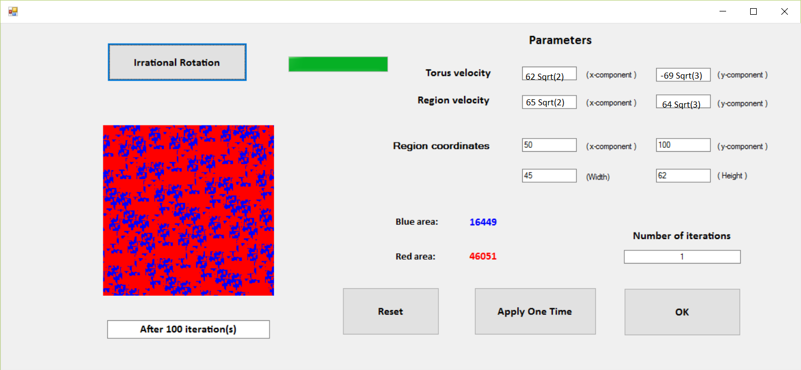
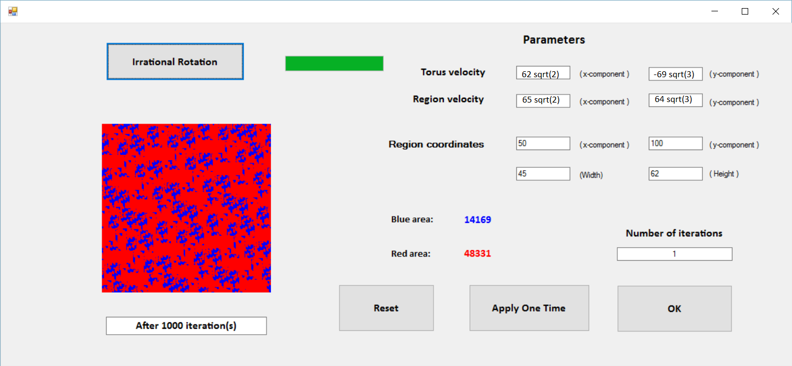

# Dynamics-of-piecewise-translation-maps
Simulate the attractor of piecewise translation maps

Here are the simulation of a piecewise translation map on a torus. The blue area indicates the attractor of the map.

After 100 iterations:

After 1000 iterations:

